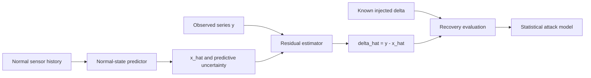

# Research Trajectory: Temporal Additive Attack Inference

**Status:** active long-horizon reference
**Last updated:** 2026-09-15
**Current position:** Sprint 1 complete; Sprint 2 runner and analysis implemented, GPU smoke pending
**Primary objective:** infer and statistically characterize observation-only additive attack error in multivariate physical sensor time series.

## 1. The Research Claim We Are Building Toward

For an observed sensor vector `y(t)`, the project studies the observation model:

`y(t) = x(t) + delta_x(t)`

- `x(t)`: unobserved clean physical sensor value.
- `delta_x(t)`: additive observation attack, including its onset, support, affected sensors, sign, magnitude, temporal shape, duration, and uncertainty.
- `y(t)`: value available to a detector or estimator.

The completed inverse-problem artifact is not merely an alarm. Given `y` and a normal-state model, it must return an estimate `x_hat(t)`, an attack estimate `delta_hat_x(t) = y(t) - x_hat(t)`, and calibrated uncertainty. The result is conditionally identifiable only under explicit assumptions about normal dynamics and attack structure; `y` alone cannot uniquely separate `x` and `delta_x`.

## 2. Evidence and Claim Boundaries

| Evidence type | Permitted conclusion | Prohibited conclusion |
|---|---|---|
| Real HAI, SWaT, WADI, or BATADAL labels | Detection, event recall, delay, and qualitative attack alignment | Exact attack magnitude or true clean signal recovery |
| Synthetic injection into known clean normal data | Support, sign, onset, duration, magnitude, and uncertainty recovery for known `delta_x` | General recovery on unobserved real attacks |
| Held-out injected attack families and seeds | Generalization within the defined synthetic threat model | Universality beyond that threat model |
| Cross-dataset replication | Robustness across the selected sensor datasets | Causal/process attack modeling |

**Non-goal:** actuator manipulation, physical process simulation, and causal attack attribution are outside this observation-only formulation.

## 3. Current Evidence Base

| Phase | Status | Result | Evidence |
|---|---|---|---|
| Common data and attack contract | complete | Canonical loaders and additive injection/recovery metric interfaces exist. | `src/data/registry.py`, `src/attacks/additive.py`, `src/evaluation/attack_metrics.py` |
| Raw statistical detector controls | complete | Raw sensor-level scores conflate normal regime shifts with attacks; HAI/SWaT EWMA and PCA/SPE showed approximately 99-100% FPR in the smoke. | `results/statistical_baselines/calibrated_smoke_analysis/INSPECTION.md` |
| Residual measurement layer | complete | Persistence residuals produced bounded FPR and attack-aligned transition evidence, but can lose a persistent offset after the signal settles. | `results/statistical_baselines/residual_smoke_analysis/INSPECTION.md` |
| Normal-only neural forecaster | complete smoke | BATADAL showed decreasing validation loss and useful event evidence; HAI, SWaT, and WADI exposed normal-regime mismatch under the shared configuration. | `results/lstm_forecaster/gh_dev_smoke_analysis/INSPECTION.md` |

The evidence supports residual-based attack measurement as the correct next layer. It does not yet support a delta-recovery claim.

## 4. End-to-End Research Loop

The loop is intentionally ordered. Detection experiments establish whether residuals carry attack information. Injected benchmarks then establish whether the residual estimates the attack. Only after that can the project fit a statistical model to the recovered attack trajectories.

## 5. Phased Roadmap and Stopping Points

### Phase A: Measurement Foundation — Sprint 1

**State:** complete.

**Delivered:** calibrated raw controls, residual baselines, a checkpointed normal-only LSTM forecaster, repository-relative runners, and artifact-first inspection.

**Stop point met:** a neural residual can be produced end-to-end on Vista and inspected without loading raw result artifacts into agent context.

**Decision:** do not spend more Sprint 1 effort tuning raw-level detectors. Their failure is a negative-control result, not a bug to optimize away.

### Phase B: Stable Forecaster and Pilot Recovery — Sprint 2

**State:** active. The repository-tracked BATADAL ablation configuration, grid runner, and aggregate-only inspection path are complete; the reduced `gh-dev` smoke is the next evidence gate.

**Question:** can a bounded, reproducible BATADAL configuration produce a stable normal-state forecast residual that remains usable under controlled injections?

**Work:** configuration contract tests; BATADAL context/hidden-size/epoch ablation; selection report; injected step, ramp, periodic, and multi-sensor pilot suite.

**Advance gate:** validation loss decreases, normal-test FPR is at most 5% in the reduced smoke, a checkpoint and compact inspection artifacts exist, and the pilot returns all recovery metrics against known `delta_x`.

**Stop/redesign gate:** no bounded BATADAL configuration meets the forecast-quality gate. Audit normal-regime split, sensor preprocessing, and threshold calibration before changing architecture or training longer.

**Reference:** `.agent-tasks/sprint-2/PLAN.md`, `.agent-tasks/sprint-2/TASKS.md`, `.agent-tasks/sprint-2/DECISIONS.md`.

### Phase C: Delta-Recovery Benchmark — Sprint 3

**State:** contingent on Phase B.

**Question:** does `delta_hat_x` recover injected attack trajectories better than simple residual controls across attack shapes and severities?

**Work:** freeze the selected forecaster; define train/validation/test injection seeds and severities; compare LSTM residual to persistence residual; evaluate per-sensor and multi-sensor attacks.

**Required metrics:** support precision/recall/F1, normalized magnitude error, sign accuracy on attacked points, onset error, duration error, and predictive-interval coverage. Report performance by attack shape, magnitude band, sensor count, and temporal overlap.

**Advance gate:** the pre-registered held-out injection suite shows improvement over the persistence-residual control on recovery metrics, with bounded normal FPR and no material degradation on an unseen attack family.

**Stop/redesign gate:** recovery is limited to onset spikes or collapses for sustained offsets. Evaluate a longer-context/state-space predictor or an explicit temporal attack prior; do not claim full delta recovery.

### Phase D: Statistical Model of Attack Error — Sprint 4

**State:** contingent on Phase C.

**Question:** can the project characterize and quantify uncertainty in recovered `delta_x`, rather than only point-estimate it?

**Work:** model residual/prediction-error distributions conditional on normal regime, sensor, temporal context, and attack family; produce point estimates plus prediction intervals; assess calibration and failure modes.

**Advance gate:** on held-out injected attacks, uncertainty intervals achieve their stated empirical coverage and distinguish low-confidence estimates from accurate recovery cases.

**Stop/redesign gate:** uncertainty is uncalibrated or only reflects nominal residual noise. Revisit predictor uncertainty, regime conditioning, and the injection threat model before adding complexity.

### Phase E: Cross-Dataset Robustness — Sprint 5

**State:** contingent on Phase D.

**Question:** which parts of the attack-recovery method transfer across HAI, SWaT, WADI, and BATADAL when normal-regime configuration is explicit?

**Work:** dataset-specific configuration, normal-regime audit, fixed protocol replication, and failure taxonomy. Architectures remain shared unless configuration evidence proves an architecture limitation.

**Advance gate:** every dataset has a documented outcome: successful recovery within the defined threat model, bounded partial recovery, or an evidence-backed failure mode.

**Stop point:** finish with a scoped robustness statement, not forced parity across datasets.

### Phase F: Multi-Attack Reasoning — Future, Not a Current Dependency

**State:** deferred.

The agentic component may reason over multiple recovered attacks only after the estimator reliably outputs attack trajectories and uncertainty. It should consume `delta_hat_x`, confidence, and event segments; it must not substitute language-model reasoning for the inverse estimator.

**Entry gate:** Phase D is complete and Phase E has at least one reproducible recovery case plus documented failure boundaries.

## 6. Final Completion Definition

The research objective is complete when a reproducible pipeline can, for a declared observation-only threat model:

1. Train a normal-state predictor without attack-label leakage and persist its normalization and checkpoint.
2. Generate or load a held-out injected attack suite with known `x`, `delta_x`, seeds, and metadata.
3. Estimate `x_hat`, `delta_hat_x`, and uncertainty from `y` using only the allowed normal-state information.
4. Beat the locked persistence-residual control on pre-registered delta-recovery metrics while retaining bounded normal false positives.
5. Produce a compact statistical report that states the valid attack families, quantified errors, uncertainty calibration, datasets, and explicit failure conditions.

Numeric acceptance thresholds for the final held-out benchmark must be locked before Phase C evaluation. They may be informed by the Sprint 2 pilot, but may not be relaxed after test results are seen.

## 7. Invariants for Every Sprint

- Preserve the `y = x + delta_x` observation-only scope unless the user explicitly opens a new research track.
- Keep real labels separate from synthetic delta ground truth.
- Write locked specification tests before implementation; do not weaken existing assertions.
- Use repository-relative inputs and outputs. Store large artifacts under `results/` and inspect only script-generated reports and plots.
- Run a reduced end-to-end smoke before any longer Vista job; obtain explicit approval with queue and SU estimate before allocation use.

## 8. Authoritative Documents and Update Protocol

| Document | Role | Update trigger |
|---|---|---|
| `.agent-tasks/TRAJECTORY.md` | Long-horizon objective, phase gates, and final completion definition | At a phase exit or when research scope changes |
| `.agent-tasks/sprint-N/PLAN.md` | Current sprint execution plan and exit criteria | Before implementation and when scope is approved to change |
| `.agent-tasks/sprint-N/TASKS.md` | Atomic progress ledger and immediate next task | After every completed task or blocker |
| `.agent-tasks/sprint-N/DECISIONS.md` | Accepted/proposed decisions and rejected alternatives | Whenever evidence resolves a design choice |

When a sprint ends, record its evidence in its own folder, update this trajectory's current position and phase status, then initialize the next sprint. Do not overwrite accepted historical decisions; supersede them explicitly.
